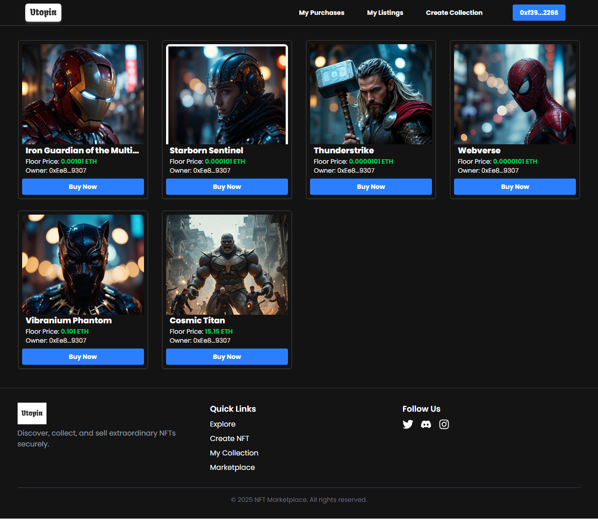
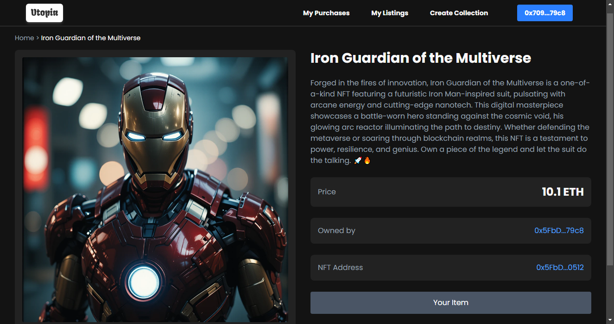
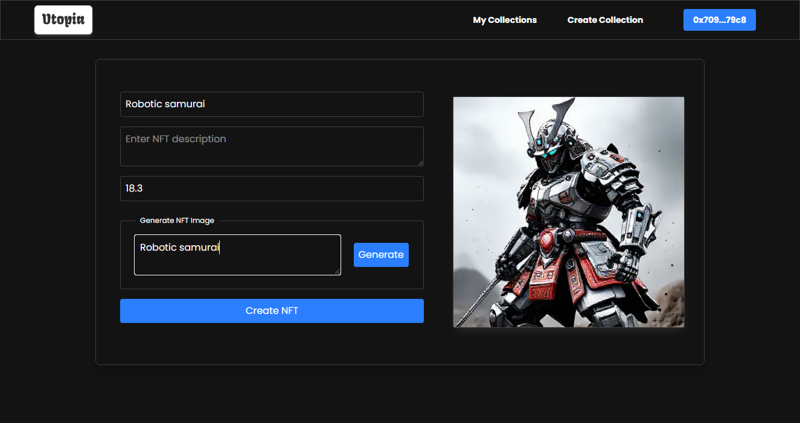

# NFT Marketplace

## About the Project

By leveraging the use of text to image generation Models we can create a more unique art pieces to be forever memorized in the Blockchain.

This project is a decentralized NFT Marketplace built on the Ethereum blockchain. It allows users to create, list, and purchase NFTs. The significance of this project lies in its ability to provide a platform for artists and collectors to trade digital assets securely and transparently.

## Screenshot of the Application

- **Home Page**
  
- **NFT details Page**
  
- **Create NFT page**
  

## List of Technologies Used

- **Frontend:**

  - React
  - Vite
  - Tailwind CSS
  - React Router
  - Axios
  - React Toastify

- **Blockchain:**

  - Solidity
  - Hardhat
  - OpenZeppelin Contracts
  - MetaMask

- **Others:**
  - Pinata (for IPFS storage)
  - Ethers.js
  - Flux API for AI image generation

## How to Clone and Run the App

1. **Clone the repository:**
   ```sh
   git clone https://github.com/arod12345/NFT-MarketPlace.git
   cd NFT-MarketPlace
   ```
2. **Install dependencies:**
   ```sh
       npm install
   ```
3. **Set up environment variables:**

   - `.env` file in the root directory and add the following:

   ```sh
   VITE_API_URL=your_api_url
   VITE_API_KEY=your_api_key
   VITE_HOST_DATA=your_host_data
   ```

4. **Compile the smart contracts:**
   ```sh
   npx hardhat compile
   ```
5. **Deploy the smart contracts:**

   - for local node

   ```sh
     npm run deploy
   ```

   - for sepolia and other networks

   ```sh
    npm run deploy:sepolia
   ```

6. **Run the application:**

   ```sh
   npm run dev
   ```

7. **Open the application:**

   - Open your browser and navigate to `http://localhost:5173`.

## Things That I Will Implement in the Future

- Auction System: Implement an auction system for NFTs.
- User Profiles: Add user profiles to display owned and created NFTs.
- Advanced Search: Enhance the search functionality with filters and sorting options.
- Mobile Responsiveness: Improve the mobile responsiveness of the application.
- Multi-Chain Support: Add support for multiple blockchain networks.

## Live Instance of the App

You can access the live instance of the application [Here](https://nft-market-place-rho-three.vercel.app/).

```sh

Make sure to replace placeholders like `your-api-key`, `your_api_url`, `your_api_key`, `your_host_data`, `your_network`, and `your-live-app-url.com` with actual values specific to your project.
Make sure to replace placeholders like `your-api-key`, `your_api_url`, `your_api_key`, `your_host_data`, `your_network`, and `your-live-app-url.com` with actual values specific to your project.
```
